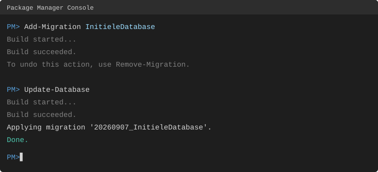

## 3.1 Inleiding

De apps die je tot nu toe maakte, werkten met enkel tijdelijke waarden en fields: alles is vergeven en vergeten zodra je de app afsluit. Zo werkt het in het echt natuurlijk niet: de Albert Heijn begint niet met een lege Bonuskaart-database nadat de stroom is uitgevallen. In dit hoofdstuk bewaar je gegevens langer door ze op te slaan in een **database**.

Er zijn verschillende typen databases: jullie werkten tot nu toe met MySQL, maar je hebt vast ook wel eens gehoord van T-SQL, Oracle, PostgreSQL of NoSQL. Gelukkig hoef je die niet allemaal te kennen om er in C# mee te werken, en dat komt door **Entity Framework Core**. Met EF Core communiceer je met een database zonder enige kennis van die database: je programmeert gewoon in C# zoals je gewend bent, en EF Core regelt de rest.

Wanneer je een app met EF Core gaat maken, volg je steeds de volgende stappen:

1. Maak een nieuw project;
2. Bedenk welke classes er in jouw app voorkomen;
3. Schrijf de benodigde classes;
4. Importeer de benodigde EF Core-packages;
5. Maak een database aan;
6. Schrijf je dataclass;
7. Maak een migratie;
8. Voer de migratie uit op je database;
9. Vul je database met eerste gegevens.

## 3.2 ORM

Je hebt net gelezen dat je met EF Core in C# kunt programmeren, zonder dat je zelf SQL hoeft te schrijven. Dat komt omdat EF Core een **ORM** is: een Object-Relational Mapper.

Een database bestaat uit tabellen met rijen en kolommen (relationeel), terwijl je in C# met classes en objecten werkt (objectgeoriënteerd). Die twee "werelden" spreken normaal gesproken niet dezelfde taal: een database begrijpt alleen SQL, en C# begrijpt alleen C#-code. Een ORM vormt de brug tussen deze twee werelden: het vertaalt jouw classes en objecten automatisch naar tabellen en rijen (en andersom), zodat jij gewoon in C# kunt blijven programmeren en de ORM de vertaling naar SQL voor je verzorgt.

Stel je hebt een class `ToDo` in je app (zo'n model bouw je in 3.4). Wanneer je een nieuw `ToDo`-object aanmaakt en opslaat, genereert EF Core zelf de bijbehorende SQL-code om een nieuwe rij toe te voegen aan de `ToDo`-tabel. Wil je alle taken ophalen? Dan schrijf je gewoon C#-code, en EF Core vertaalt dit op de achtergrond naar een `SELECT`-query.

Het grote voordeel van werken met een ORM zoals EF Core is dus dat je vrijwel geen handmatig SQL meer hoeft te schrijven: je blijft gewoon in C# programmeren, en EF Core regelt de communicatie met de database. Dit maakt je code overzichtelijker, minder foutgevoelig, en makkelijker te onderhouden. Daarnaast zorgt EF Core er via migrations (zie 3.6) automatisch voor dat de structuur van je database in de pas blijft lopen met je C#-classes.

<x-keuzevraag>
question: Wat is de belangrijkste taak van een ORM zoals EF Core?
options:
  - Je database sneller maken
  - Je C#-classes en -objecten vertalen naar tabellen en rijen (en andersom)
  - Je code compileren
  - Automatisch een gebruikersinterface bouwen
correct: 1
explanation: Een ORM is de brug tussen de objectgeoriënteerde wereld van C# en de relationele wereld van de database.
</x-keuzevraag>

## 3.3 Packages

Om gebruik te maken van EF Core installeer je de volgende packages:

- `Microsoft.EntityFrameworkCore`
- `Microsoft.EntityFrameworkCore.Tools`
- `Pomelo.EntityFrameworkCore.MySql`

<x-callout type="warning">

**Let op:** alle EF Core-packages moeten exact dezelfde versie hebben, anders werkt het niet. De nieuwste versie van `Pomelo.EntityFrameworkCore.MySql` is een 9-versie (`9.*`), dus installeer van álle packages hierboven de nieuwste `9.*`-versie.

</x-callout>


Zowel Microsoft als Pomelo houden de conventie aan om bij elkaar horende packageversies met hetzelfde Major-versienummer te laten beginnen. Zo is makkelijk te zien welke versies met elkaar 'compatibel' zijn — en houd je ze dus allemaal op dezelfde versie.

## 3.4 Een EF Core-model maken

Stel, je wilt een eenvoudige "ToDo"-app maken, waarin jij je eigen taken en huiswerk bij kunt houden… Welke gegevens moet je dan allemaal in een database opslaan? Nou… een "taak" heeft waarschijnlijk een titel, misschien een uitgebreide beschrijving, een deadline, en een field "voldaan"… Dus als je in C# een class `ToDo` zou gaan maken, zou dat er waarschijnlijk zo uitzien:

```csharp
public class ToDo
{
    public int Id { get; set; }
    public string Title { get; set; }
    public string Description { get; set; }
    public DateTime Deadline { get; set; }
    public bool IsDone { get; set; }
}
```

En daar is je model. EF Core haalt (bij het maken van een migratie) uit je class op welke gegevens jij in de database wilt opslaan, en maakt op basis daarvan een migratie aan. Na het updaten van je database, zul je zien dat al deze fields in je tabel zijn aangemaakt.

<x-callout type="warning">

Maak in je model **properties** (`int Id { get; set; }`), géén fields (`int Id;`). EF Core werkt met properties.

</x-callout>

## 3.5 Verbinding met de database

Om met EF Core een verbinding met een database op te zetten, beginnen we met een dataclass (ook wel de *context*). Hier komt alle logica die nodig is om de verbinding op te zetten. Het bestand bestaat grofweg uit twee delen.

### OnConfiguring

De `OnConfiguring`-methode is een methode die door EF Core wordt aangeroepen om verbinding te maken met de database. In deze methode gebeurt maar één ding, namelijk verbinding maken met de database. Hiervoor gebruikt EF Core de gegevens die je hebt opgegeven in de connection string. Een voorbeeld zie je hieronder:

```csharp
protected override void OnConfiguring(DbContextOptionsBuilder optionsBuilder)
{
    if (!optionsBuilder.IsConfigured)
    {
        optionsBuilder.UseMySql(
            "server=localhost;" +              // Server name
            "port=3306;" +                     // Port number
            "user=c_sharp_dev;" +              // The user
            "password=c_sharp_dev;" +          // The password
            "database=csd_iv_cijferApp_v1_0"   // Database name
            , Microsoft.EntityFrameworkCore.ServerVersion.Parse("10.4.17-mariadb"));
    }
}
```

Hier maken we dus verbinding met een database op localhost via poort 3306. We loggen in met de gebruikersnaam `c_sharp_dev` en wachtwoord `c_sharp_dev` en maken verbinding met de database genaamd `csd_iv_cijferApp_v1_0`. Om deze methode voor jou te laten werken, hoef je alleen maar deze gegevens aan te passen aan de gegevens van jouw database.

### DbSet

Voor iedere class die je in je database wilt opslaan (bijvoorbeeld "Studenten"), maak je een `DbSet`-field aan. `DbSet` is een speciale class in EF Core. Bij het aanmaken van de `DbSet` moet je óók het datatype opgeven van de class die je wilt opslaan. Wanneer je bijvoorbeeld Pokémon gaat opslaan in je database, en je classname is `Pokemon`, zou de `DbSet` er als volgt uitzien:

```csharp
public DbSet<Pokemon> Pokemons { get; set; }
```

Hiermee vertellen we EF Core dat we een nieuwe class willen gaan bijhouden in de database, namelijk `Pokemon`. Dit zie je aan het feit dat `Pokemon` tussen `<` en `>` staat. We willen dat deze `DbSet` "Pokemons" heet, en omdat we met EF Core werken, is het belangrijk dat we van deze variabele een property maken. Met de access modifier `public` geven we aan dat iedereen deze property mag bekijken en bewerken.

<x-invul>
prompt: Vul de DbSet-regel aan waarmee je de class Voertuig in de database bijhoudt onder de naam "Voertuigen".
code: |-
  public ___<Voertuig> ___ { get; set; }
blanks:
  - answer: DbSet
  - answer: Voertuigen
explanation: "Het type tussen < > is de class die je opslaat; de property-naam is meestal het meervoud."
</x-invul>

## 3.6 Migrations

Misschien herken je de term 'migration' van WEB (Laravel). In C# werkt het ongeveer hetzelfde, alleen genereert EF Core de migratie voor je. Een migration houdt je database up-to-date bij veranderingen in je app.

Je app en je database moeten namelijk altijd bij elkaar passen. Voeg je een property `Naam` toe aan een class, dan moet er ook een kolom `Naam` in de tabel komen — anders krijg je foutmeldingen. Een migration is een soort 'patch' voor je database: het beschrijft precies welke wijzigingen nodig zijn om de database in de goede vorm te brengen voor díe versie van je app. Bij elke nieuwe versie maak je een migration, en die zorgt dat de database meeloopt met de code. Handig in OTAP-omgevingen, waar ontwikkel (O), test (T), acceptatie (A) en productie (P) elk een andere versie kunnen draaien.

### Een migratie maken

Migraties maak je via de **Package Manager Console** (in Visual Studio: *Tools → NuGet Package Manager → Package Manager Console*). Je typt twee commando's:

```powershell
Add-Migration InitieleDatabase
Update-Database
```



`Add-Migration <Naam>` laat EF Core je model vergelijken met de vorige migratie en schrijft het verschil weg als een nieuw migratiebestand in je project. `<Naam>` is een korte, beschrijvende naam die jij kiest (bijvoorbeeld `InitieleDatabase` of `KolomNaamToegevoegd`), zodat je later terug kunt zien wat elke migratie deed. Op dit moment is er nog **niets** aan je database veranderd — je hebt alleen een instructie klaargezet.

`Update-Database` voert de migratie(s) die nog niet zijn toegepast daadwerkelijk uit op je database: EF Core vertaalt het migratiebestand naar SQL (`CREATE TABLE`, `ALTER TABLE`…) en draait dat tegen de database. Pas na deze stap staan je tabellen en kolommen er echt. Je moet `Update-Database` dus altijd draaien nadat je een migratie hebt gemaakt — anders loopt je database achter op je code.

<x-nav label="Klaar met de theorie?">
[Oefeningen](/pages/week3-oefeningen.html)
[Quiz](/pages/week3-meetmoment.html)
[Week 4](/pages/week4-theorie.html)
</x-nav>
