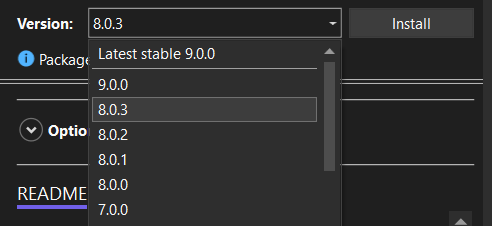
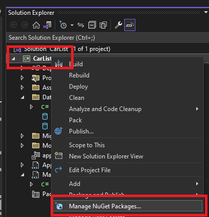

## 3.1 Inleiding

In dit hoofdstuk leer je hoe je met behulp van Entity Framework Core eenvoudig verbinding kunt maken met een database, hoe je ervoor zorgt dat je database up-to-date blijft en hoe je je database inricht — genormaliseerd en wel — door goed na te denken over je model.

We hebben tot nu toe veel verschillende soorten apps gemaakt, maar tot nu toe werkten die allemaal met enkel tijdelijke waarden en fields: alles is vergeven en vergeten zodra je de app afsluit. Dat is natuurlijk niet hoe het in het echt werkt: de Albert Heijn begint niet met een lege Bonuskaart-database nadat de stroom is uitgevallen.

Er zijn verschillende manieren waarop we gegevens langer kunnen bewaren. Zo kunnen we natuurlijk gegevens wegschrijven naar een bestand, we zouden gegevens kunnen printen, mailen, met wat werk zelfs nog kunnen faxen, maar in dit hoofdstuk gaan we kijken hoe we gegevens kunnen opslaan in een database.

Zoals je wellicht weet, zijn er verschillende typen databases: degene waar jullie tot nu toe mee hebben gewerkt is MySQL, maar misschien heb je ook wel eens gehoord van T-SQL (van Microsoft), Oracle, NoSQL, PostgreSQL… er zijn er te veel om op te noemen. Gelukkig hoef jij dat allemaal niet te weten als je in C# met databases wilt gaan werken, en dat komt door Entity Framework Core. EF Core stelt je in staat om te communiceren met een database, zonder enige kennis van en over die database. Met EF Core kun je gewoon in C# programmeren zoals je gewend bent, en EF Core regelt de rest voor je.

Wanneer je een app met EF Core gaat maken, volg je steeds de volgende stappen:

1. Maak een nieuw project;
2. Bedenk welke classes er in jouw app voorkomen;
3. Schrijf de benodigde classes;
4. Importeer de benodigde EF Core-packages;
5. Maak een database aan;
6. Schrijf je dataclass;
7. Maak een migratie;
8. Voer de migratie uit op je database;
9. Vul je database met eerste gegevens.

## 3.2 Migrations

Misschien herken je de term 'migration' van WEB, waar je met migrations in Laravel hebt gewerkt. In C# zijn migrations ongeveer hetzelfde, alleen doet C# een aantal zaken voor jou, die je bij Laravel zelf moet regelen. Voor de duidelijkheid: wat is een migration? Een migration is een manier om bij veranderingen in je app je database up-to-date te houden. Oké, leuk, maar wat bedoelen we daarmee? Waarom is dat belangrijk?

Stel, jij heet Albert H. en je hebt een winkeltje waar je levensmiddelen verkoopt. Op een dag komt iemand op het idee om vaste klanten korting te geven: vaste klanten kunnen een Boguskaart aanvragen, en op vertoon van die kaart krijgen ze extra aanbiedingen op bepaalde producten. Je kaart is een enorm succes en je bedenkt dat je nóg meer geld kunt verdienen als je meer van je vaste klanten weet. Vanaf nu moeten mensen dus hun naam opgeven als ze een Boguskaart ophalen. Iets later bedenk je dat het handig zou zijn als je bijhoudt welke producten je vaste klanten kopen, welke aanbiedingen wel werken en welke niet. En nog iets later bedenk je dat je misschien ook wel bij wilt houden hoe laat een klant vaak winkelt, en het gemiddelde bestedingsbedrag en per klant het bestedingspercentiel en de haarkleur en schoenmaat, en, en, en…

Al deze wensen vereisen aanpassingen aan je app (want ineens moet er een field "naam" in je app komen, zodat je de klantnaam in kunt voeren), én in je database, zodat de ingevoerde naam ook daadwerkelijk wordt opgeslagen. Maar dat kan soms best lastig zijn: als je de app aanpast voordat je de database aanpast krijg je foutmeldingen ("kolom niet gevonden"), maar als je de database aanpast voordat je de app aanpast, krijg je lege cellen, wat óók een foutmelding op kan leveren. De oplossing voor al deze problemen zijn *migraties*. Een migratie is een soort 'patch' voor je database en zorgt ervoor dat je database in precies de goede vorm is, voor díe versie van je app. Als je een nieuwe versie van je app uitrolt, maak je een migration voor die versie, en die zorgt ervoor dat de database waarmee je praat up-to-date is met de app die je draait. Dit is met name handig in OTAP-omgevingen, waar je op je ontwikkelomgeving (O) misschien een andere versie draait dan op de testomgeving (T), waar weer een andere versie op draait dan op je acceptatieomgeving (A), wat weer een andere versie is dan de versie die in productie (P) draait.

## 3.3 Packages

Om gebruik te maken van EF Core moet je de volgende packages installeren:

- `Pomelo.EntityFrameworkCore.MySQL`
- `Microsoft.EntityFrameworkCore.Tools`

<x-callout type="warning">

**Let op:** installeer de laatste minor versie die overeenkomt met de gekozen .NET-versie. Dus bij .NET 8.0 kies je de hoogste versie die begint met `8.*`.

</x-callout>



Zowel Microsoft als Pomelo houden de conventie aan om versies van hun packages met dezelfde Major versie te laten beginnen, zo is het makkelijk te vinden welke versies met elkaar 'compatibel' zijn.

## 3.4 Een EF Core-model maken

### Simpel model

Stel, je wilt een eenvoudige "ToDo"-app maken, waarin jij je eigen taken en huiswerk bij kunt houden… Welke gegevens moet je dan allemaal in een database opslaan? Nou… een "taak" heeft waarschijnlijk een titel, misschien een uitgebreide beschrijving, een deadline, en een field "voldaan"… Dus als je in C# een class `ToDo` zou gaan maken, zou dat er waarschijnlijk zo uitzien:

```csharp
public class ToDo
{
    public int Id { get; set; }
    public string Title { get; set; }
    public string Description { get; set; }
    public DateTime Deadline { get; set; }
    public bool IsDone { get; set; }
}
```

En daar is je model. EF Core haalt (bij het maken van een migratie) uit je class op welke gegevens jij in de database wilt opslaan, en maakt op basis daarvan een migratie aan. Na het updaten van je database, zul je zien dat al deze fields in je tabel zijn aangemaakt.

<x-callout type="warning">

Maak in je model **properties** (`int Id { get; set; }`), géén fields (`int Id;`). EF Core werkt met properties.

</x-callout>

### ORM

Je hebt in dit hoofdstuk al gezien dat je met EF Core in C# kunt programmeren, zonder dat je zelf SQL hoeft te schrijven. Dat komt omdat EF Core een **ORM** is: een Object-Relational Mapper.

Een database bestaat uit tabellen met rijen en kolommen (relationeel), terwijl je in C# met classes en objecten werkt (objectgeoriënteerd). Die twee "werelden" spreken normaal gesproken niet dezelfde taal: een database begrijpt alleen SQL, en C# begrijpt alleen C#-code. Een ORM vormt de brug tussen deze twee werelden: het vertaalt jouw classes en objecten automatisch naar tabellen en rijen (en andersom), zodat jij gewoon in C# kunt blijven programmeren en de ORM de vertaling naar SQL voor je verzorgt.

Denk bijvoorbeeld terug aan de class `ToDo` die we hierboven hebben gemaakt. Wanneer je een nieuw `ToDo`-object aanmaakt en opslaat, genereert EF Core zelf de bijbehorende SQL-code om een nieuwe rij toe te voegen aan de `ToDo`-tabel. Wil je alle taken ophalen? Dan schrijf je gewoon C#-code, en EF Core vertaalt dit op de achtergrond naar een `SELECT`-query.

Het grote voordeel van werken met een ORM zoals EF Core is dus dat je vrijwel geen handmatig SQL meer hoeft te schrijven: je blijft gewoon in C# programmeren, en EF Core regelt de communicatie met de database. Dit maakt je code overzichtelijker, minder foutgevoelig, en makkelijker te onderhouden. Daarnaast zorgt EF Core er via migrations (zie 3.2) automatisch voor dat de structuur van je database in de pas blijft lopen met je C#-classes.

<x-keuzevraag>
question: Wat is de belangrijkste taak van een ORM zoals EF Core?
options:
  - Je database sneller maken
  - Je C#-classes en -objecten vertalen naar tabellen en rijen (en andersom)
  - Je code compileren
  - Automatisch een gebruikersinterface bouwen
correct: 1
explanation: Een ORM is de brug tussen de objectgeoriënteerde wereld van C# en de relationele wereld van de database.
</x-keuzevraag>

## 3.5 Verbinding met de database

Om met EF Core een verbinding met een database op te zetten, beginnen we met een dataclass (ook wel de *context*). Hier komt alle logica die nodig is om de verbinding op te zetten. Het bestand bestaat grofweg uit twee delen.

### OnConfiguring

De `OnConfiguring`-methode is een methode die door EF Core wordt aangeroepen om verbinding te maken met de database. In deze methode gebeurt maar één ding, namelijk verbinding maken met de database. Hiervoor gebruikt EF Core de gegevens die je hebt opgegeven in de connection string. Een voorbeeld zie je hieronder:

```csharp
protected override void OnConfiguring(DbContextOptionsBuilder optionsBuilder)
{
    if (!optionsBuilder.IsConfigured)
    {
        optionsBuilder.UseMySql(
            "server=localhost;" +              // Server name
            "port=3306;" +                     // Port number
            "user=c_sharp_dev;" +              // The user
            "password=c_sharp_dev;" +          // The password
            "database=csd_iv_cijferApp_v1_0"   // Database name
            , Microsoft.EntityFrameworkCore.ServerVersion.Parse("10.4.17-mariadb"));
    }
}
```

Hier maken we dus verbinding met een database op localhost via poort 3306. We loggen in met de gebruikersnaam `c_sharp_dev` en wachtwoord `c_sharp_dev` en maken verbinding met de database genaamd `csd_iv_cijferApp_v1_0`. Om deze methode voor jou te laten werken, hoef je alleen maar deze gegevens aan te passen aan de gegevens van jouw database.

### DbSet

Voor iedere class die je in je database wilt opslaan (bijvoorbeeld "Studenten"), maak je een `DbSet`-field aan. `DbSet` is een speciale class in EF Core. Bij het aanmaken van de `DbSet` moet je óók het datatype opgeven van de class die je wilt opslaan. Wanneer je bijvoorbeeld Pokémon gaat opslaan in je database, en je classname is `Pokemon`, zou de `DbSet` er als volgt uitzien:

```csharp
public DbSet<Pokemon> Pokemons { get; set; }
```

Hiermee vertellen we EF Core dat we een nieuwe class willen gaan bijhouden in de database, namelijk `Pokemon`. Dit zie je aan het feit dat `Pokemon` tussen `<` en `>` staat. We willen dat deze `DbSet` "Pokemons" heet, en omdat we met EF Core werken, is het belangrijk dat we van deze variabele een property maken. Met de access modifier `public` geven we aan dat iedereen deze property mag bekijken en bewerken.

<x-invul>
prompt: Vul de DbSet-regel aan waarmee je de class Voertuig in de database bijhoudt onder de naam "Voertuigen".
code: |-
  public ___<Voertuig> ___ { get; set; }
blanks:
  - answer: DbSet
  - answer: Voertuigen
explanation: "Het type tussen < > is de class die je opslaat; de property-naam is meestal het meervoud."
</x-invul>

## 3.6 Stappenplan: een nieuwe C#-app met EF Core starten (MySQL)

1. Start Visual Studio, kies voor 'Create a new project';
2. Kies het type app (Console, WPF, UWP, etc.) dat je wilt maken en druk op 'Next';
3. Geef je app een toepasselijke naam, selecteer de map waar je het project wilt opslaan en druk op 'Next';
4. Druk op 'Next';
5. Rechtsklik op je project in de Solution Explorer en kies voor 'Manage NuGet Packages':

    

6. Ga naar het tabblad 'Browse' en zoek en installeer de volgende packages:
   1. `Microsoft.EntityFrameworkCore.Design`
   2. `Microsoft.EntityFrameworkCore.Tools`
   3. `Pomelo.EntityFrameworkCore.MySql`
7. Rechtsklik op je project in de Solution Explorer en voeg de volgende mappen toe:
   1. `Model`;
   2. `View`;
   3. `Controller`;
   4. `Data`.
8. Maak in de `Data`-folder een context-class aan: als je app `FamilyPhotos` heet, noem je deze class `FamilyPhotosContext`;
9. Wanneer je die nog niet hebt, maak je een nieuwe MySQL-database aan;
10. Wanneer je dat nog niet hebt, maak je een nieuwe MySQL-gebruiker aan:
    1. User name: `c_sharp`
    2. Host name: any host (`%`)
    3. Wachtwoord: `c_sharp`
    4. Alle privileges ("Check all").
11. Kopieer de `OnConfiguring`-code hierboven naar je datacontext en pas de gebruiker en het wachtwoord aan (indien nodig);
12. Maak nu je model aan: maak classes voor alle objecten die je in je app wilt gebruiken en definieer alle eigenschappen die je wilt opslaan. **LET OP:** maak hier properties (`int thisInt { get; set; }`) van, géén fields.
13. Voeg in je datacontext voor iedere class die je wilt opslaan in je database de volgende regel toe (pas `Car` en `Cars` uiteraard aan naar de juiste class en een logische naam):

    ```csharp
    public DbSet<Car> Cars { get; set; }
    ```

14. Ga naar Tools > NuGet Package Manager > Package Manager Console;
15. Maak een nieuwe migratie door te typen: `Add-Migration <Name>` met een passende naam voor `<Name>`;
16. Pas je migratie toe met de methode `Update-Database`;
17. Controleer je database: als het goed is, is er nu voor iedere class in je datacontext een tabel aangemaakt met een kolom voor iedere property in die class.

<x-nav label="Klaar met de theorie?">
[Oefeningen](/pages/week3-oefeningen.html)
[Quiz](/pages/week3-meetmoment.html)
[Inleveropdracht](/pages/week3-inleveropdracht.html)
[Week 4](/pages/week4-theorie.html)
</x-nav>
