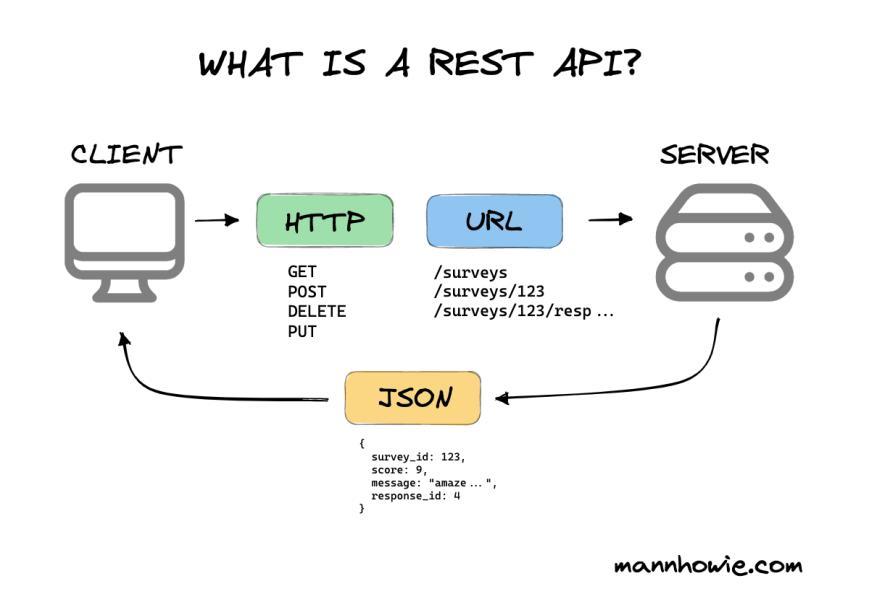
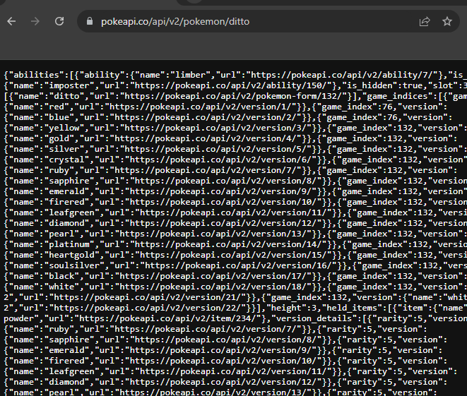
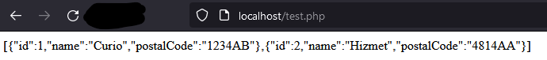

## 4.1 Inleiding

In week 3 en 4 heb je geleerd hoe je gegevens in een C#-app op kunt slaan in een database, maar er zijn nog meer manieren om gegevens op te slaan en uit te wisselen met andere apps: API's.

## 4.2 Wat is een API?

Een API, of **Application Programming Interface**, is een set van protocollen, routines en tools die softwareapplicaties in staat stellen met elkaar te communiceren.

In eenvoudigere woorden dient een API als een tussenpersoon tussen verschillende softwaresystemen, waardoor ze gegevens en instructies kunnen uitwisselen. Het definieert de regels en standaarden voor hoe applicaties met elkaar kunnen communiceren en specificeert de soorten verzoeken en antwoorden die zijn toegestaan.

De API is vaak actief op de **server** en de applicatie die de API aanroept noemen we de **client**. Een client kan een webpagina zijn die *in JavaScript* via `fetch` de API aanroept. Het kan ook een C#-applicatie zijn die gebruik maakt van de `HttpClient`-klasse om de API aan te roepen.

Het "aanroepen van een API" is simpelweg het laden van een bijzondere webpagina. Wat de webpagina bijzonder maakt is dat deze geen HTML en CSS bevat, maar 'JSON' (of XML). Vrijwel alle programmeertalen en systemen kunnen JSON begrijpen en omzetten naar objecten in code. Daarmee kunnen we code laten reageren op gegevens die in JSON genoteerd zijn.



<p style="text-align:center"><em>Bron: <a href="https://mannhowie.com/rest-api">https://mannhowie.com/rest-api</a></em></p>

In het bovenstaande plaatje zien we dat de **client** via de methodes GET, POST, DELETE of PUT een verzoek kan doen naar een bepaalde URL. Die URL is een weblocatie op een **server**. Er zijn verschillende URL's die verschillende acties uitvoeren; we noemen dat ook wel **API routes** of **endpoints**.

Bijvoorbeeld:

| Methode | Route / Endpoint | Beschrijving |
|---|---|---|
| GET | `/surveys` | Geeft alle enquêtes terug |
| GET | `/surveys/123` | Geeft de enquête terug met survey_id '123' |
| POST | `/surveys` | Voegt een enquête toe aan de server. De inhoud van het POST-verzoek moet een JSON-object zijn met daarin de gegevens van de enquête. |
| DELETE | `/surveys/123` | Verwijdert de enquête met survey_id '123' |

Een ander voorbeeld: stel dat je een weer-app ontwikkelt die informatie over de actuele weersomstandigheden nodig heeft. In plaats van je eigen meteorologische meetinstrumenten op verschillende locaties in Nederland te installeren, kun je de API van een weerprovider gebruiken om de benodigde gegevens in realtime op te halen.

Door een API te gebruiken, kun je tijd en middelen besparen door de functionaliteit van bestaande systemen te benutten, en het kan ook de algehele prestaties en schaalbaarheid van je applicatie verbeteren.

## 4.3 Moderne systemen

Waar we in de vorige module direct vanaf de client-applicatie hebben verbonden met onze MySQL-database, is dat niet gewoonlijk bij moderne systemen. In plaats van rechtstreeks verbinding te maken met de database, maakt de client-applicatie een verzoek naar de API. De API fungeert vervolgens als een brug tussen de client-applicatie en de database, waarbij het verzoek wordt ontvangen, verwerkt en doorgestuurd naar de database.

API's bieden verschillende voordelen voor moderne systemen. Ze zorgen voor een betere scheiding van verantwoordelijkheden, waarbij de database-logica wordt afgeschermd van de client-applicatie. Dit bevordert de modulariteit en flexibiliteit van het systeem, waardoor onderdelen gemakkelijker kunnen worden gewijzigd of vervangen zonder de andere componenten te beïnvloeden.

Bovendien bieden API's een gestandaardiseerde manier van communicatie, waardoor verschillende applicaties kunnen samenwerken ongeacht de technologieën die ze gebruiken. Ze stellen ontwikkelaars in staat om op een consistente en voorspelbare manier gegevens op te halen, bij te werken of te verwijderen uit de database.

Daarnaast kunnen API's ook beveiligingsvoordelen bieden. Door een API als tussenlaag te gebruiken, kan toegangscontrole en autorisatie worden toegepast op basis van de gebruiker of de client-applicatie. Dit helpt om ongeautoriseerde toegang tot de database te voorkomen en de gegevensintegriteit te waarborgen.

## 4.4 Voorbeelden

Netflix, Instagram en YouTube zijn populaire voorbeelden van moderne systemen die API's gebruiken om de communicatie tussen hun client-applicaties en databases mogelijk te maken:

- **Netflix** maakt in de client-applicatie, zoals de Netflix-website of mobiele app, gebruik van API's om gegevens op te halen, zoals gebruikersprofielen, aanbevelingen, film- en tv-showinformatie, enzovoort. Deze API's fungeren als een tussenlaag die de client-applicatie verbindt met de backend-systemen van Netflix, waar de databases zich bevinden. Op deze manier kan de client-applicatie de benodigde gegevens ophalen en presenteren aan de gebruikers.
- **Instagram** maakt ook gebruik van API's om de interactie tussen de client-applicatie (de Instagram-website of mobiele app) en de backend-databases mogelijk te maken. De API's van Instagram stellen de client-applicatie in staat om functies uit te voeren zoals het ophalen en plaatsen van foto's, het volgen van andere gebruikers, het beheren van profielinformatie en het weergeven van nieuwsfeeds. Deze API's fungeren als een brug tussen de client-applicatie en de databases van Instagram, waardoor gebruikersgegevens en -activiteiten efficiënt kunnen worden verwerkt en opgeslagen.
- **YouTube** maakt ook uitgebreid gebruik van API's. De API's van YouTube stellen ontwikkelaars in staat om functionaliteiten te integreren in hun eigen applicaties, zoals het zoeken naar video's, het uploaden van video's, het beheren van afspeellijsten, het ophalen van kanaalinformatie, het reageren op video's, enzovoort. Deze API's bieden een gestandaardiseerde manier voor ontwikkelaars om toegang te krijgen tot de enorme hoeveelheid video-inhoud en gebruikersgegevens die in de databases van YouTube worden opgeslagen.

## 4.5 Een API aanroepen

We hebben nu een idee over wat een API is en waarom we het zouden gebruiken. Wanneer een client-applicatie een API gebruikt noemen we dat ook wel 'consumeren' (Engels: *to consume*). Zoals eerder gezegd is het aanroepen van een API simpelweg het laden van een bijzondere webpagina. Laten we eens kijken naar een voorbeeld: **PokéAPI** (<https://pokeapi.co/>).


In onze lessen gebruiken we graag PokéAPI omdat het een gratis toegankelijke API is, waar geen bijzonderheden zijn qua authenticatie. Waar je bij de meeste API's moet registreren, kunnen we hier direct bij allerlei gegevens uit de Pokémon-games.

Neem bijvoorbeeld deze API-route: <https://pokeapi.co/api/v2/pokemon/ditto>

Wanneer je deze in de browser bezoekt, zie je de volgende JSON:



<x-callout type="tip">

Sommige browsers stijlen JSON met extra opmaak en functies. Open de broncode van de pagina om te zien wat de API daadwerkelijk teruggeeft (alleen tekst).

</x-callout>

Om een API te consumeren in C# gebruiken we de `HttpClient`-klasse. Dat geeft ons een soort onzichtbare browser waarmee we webverzoeken kunnen doen:

```csharp
var client = new HttpClient();
var response = await client.GetAsync("https://pokeapi.co/api/v2/pokemon/ditto");
var content = await response.Content.ReadAsStringAsync();
```

Omdat het doen van een webverzoek lang kan duren zijn enkele methodes hier **asynchroon (Async)**. Om die reden moet de methode waarin dit gebruikt wordt ook asynchroon zijn. Bij een Console App ziet een asynchrone `Main`-signature er zo uit:

```csharp
static async Task Main(string[] args)
```

Na de bovenstaande code staat in de `content`-variabele de JSON van de Pokémon genaamd "ditto". Dat JSON-object bevat allerlei informatie die we mogelijk willen ophalen, zoals bijvoorbeeld de id, naam en het gewicht van de Pokémon. Om die gegevens op te halen moeten we in C# een klasse maken die overeenkomt met de JSON:

<x-compare>
<x-compare-item title="JSON">

```json
{
  "id": 132,
  "name": "ditto",
  "weight": 40
}
```

</x-compare-item>
<x-compare-item title="Klasse die overeenkomt met JSON">

```csharp
internal class Pokemon
{
    public int Id { get; set; }
    public string Name { get; set; }
    public int Weight { get; set; }
}
```

</x-compare-item>
</x-compare>

Vervolgens kunnen we de JSON 'deserialiseren' naar een C#-object. Met deserialiseren bedoelen we: van tekst naar een object. Serialiseren is het tegenovergestelde: van een object naar tekst. Deserialiseren gaat als volgt:

```csharp
var options = new JsonSerializerOptions
{
    PropertyNameCaseInsensitive = true
};

var pokemon = JsonSerializer.Deserialize<Pokemon>(content, options);

Console.WriteLine("Gedeserialiseerde gegevens:");
Console.WriteLine(pokemon.Id);
Console.WriteLine(pokemon.Name);
```

<x-callout type="note">

De functie om te (de)serialiseren werkt dankzij `using System.Text.Json;`

</x-callout>

We geven aan de generieke methode `JsonSerializer.Deserialize<T>` het type van de klasse op de plek `T`. Zo weet de serializer welke eigenschappen er in de JSON verwacht kunnen worden. Omdat we de C#-conventies voor eigenschappen willen aanhouden (PascalCase), maar in de JSON "id", "name" en "weight" zonder hoofdletters zijn geschreven, moeten we ook een optie instellen om hoofdletterongevoeligheid aan te zetten:

```csharp
var options = new JsonSerializerOptions
{
    PropertyNameCaseInsensitive = true
};
```

<x-invul>
prompt: Vul de regel aan die de JSON in `content` omzet naar een Pokemon-object (met de options voor hoofdletterongevoeligheid).
code: |-
  var pokemon = JsonSerializer.___<___>(content, options);
blanks:
  - answer: Deserialize
  - answer: Pokemon
explanation: "Deserialize<T> zet tekst om naar een object van type T."
</x-invul>

## 4.6 JSON en deserialiseren

JSON staat voor **JavaScript Object Notation** en het is een gestructureerd datatransmissieformaat dat veel wordt gebruikt voor het uitwisselen van gegevens tussen een server en een client. Het is leesbaar voor zowel mensen als computers.

JSON is opgebouwd uit twee hoofdonderdelen: eigenschappen en waarden. Het gebruikt een structuur die lijkt op een dictionary.

Een JSON-object begint met een openingsaccolade `{` en eindigt met een sluitende accolade `}`. Tussen de accolades bevinden zich eigenschap-waarde-paren, gescheiden door een dubbele punt `:`.

Een eigenschap heeft een string-naam en kan een waarde van verschillende typen bevatten, zoals een tekenreeks, een getal, een boolean, een array of zelfs een ander JSON-object.

Hier is een voorbeeld van een JSON-object:

```json
{
  "name": "John Doe",
  "age": 25,
  "married": false,
  "hobbies": ["football", "reading", "traveling"],
  "address": {
    "street": "Main St",
    "city": "New York",
    "state": "NY"
  }
}
```

In dit voorbeeld zijn er 5 eigenschappen:

- "name" heeft een string als waarde
- "age" heeft een getal als waarde
- De waarde van "married" is van het type boolean
- "hobbies" heeft een array als waarde. Ieder item in deze array is van het type "string"
- "address" heeft een JSON-object als waarde, met 3 eigenschappen:
  - "street" heeft een string als waarde
  - Etc…

Zoals we zien herkennen we arrays in JSON aan blokhaken. Daarnaast is het mogelijk om door middel van 'nesting' JSON-objecten in JSON-objecten te hebben. Het is ook mogelijk om arrays in arrays, of arrays in JSON-objecten te plaatsen.

Wanneer je een JSON-array als "hobbies" wilt deserialiseren geef je de eigenschap het type `List<T>`. In het geval van "hobbies" zou het best passende type voor `T` logischerwijs `string` zijn.

Wanneer een eigenschap weer een object is, moet daar een andere klasse voor gemaakt worden. Om de bovenstaande JSON te deserialiseren zouden de volgende klassen nodig zijn:

```csharp
internal class Person
{
    public string Name { get; set; }
    public int Age { get; set; }
    public bool Married { get; set; }
    public List<string> Hobbies { get; set; }
    public Address Address { get; set; }
}

internal class Address
{
    public string Street { get; set; }
    public string City { get; set; }
    public string State { get; set; }
}
```

Om (weer met hoofdletterongevoeligheid) de JSON te deserialiseren gebruik je:

```csharp
var personJson = "{\"name\":\"John Doe\",\"age\":25,\"married\":false, ... }";

var options = new JsonSerializerOptions
{
    PropertyNameCaseInsensitive = true
};

var person = JsonSerializer.Deserialize<Person>(personJson, options);

Console.WriteLine($"{person.Name} woont in {person.Address.City}");
```

Soms is de JSON die je wilt deserialiseren een array. Dan kun je direct aan de `JsonSerializer.Deserialize<T>` een `List` met passend type geven. Voor een array met getallen gebruik je bijvoorbeeld:

```csharp
var arrayJson = "[3, 4, 5]";
var numbers = JsonSerializer.Deserialize<List<int>>(arrayJson);

Console.WriteLine(numbers[1]); // 4
```

Als je geen van de methodes in `List` nodig hebt (zoals toevoegen en zoeken van items), dan werkt in plaats van een `List` een array ook als type:

```csharp
var numbers = JsonSerializer.Deserialize<int[]>(arrayJson);
```

## 4.7 Een test-API

Wanneer je een client wilt bouwen, maar nog geen API hebt, zijn er verschillende manieren om een tijdelijke nep-API op te zetten. Zo'n nep-API geeft simpelweg JSON als antwoord, zonder dat het echt aan een database is gekoppeld. We noemen dat 'mocking'. Dit zijn enkele manieren om een nep-API op te zetten:

1. Je kunt een simpel PHP-script schrijven om JSON terug te geven:

   ```php
   <?php
   echo '['
       . '{"id":1,"name":"Curio","postalCode":"1234AB"},'
       . '{"id":2,"name":"Hizmet","postalCode":"4814AA"}'
       . ']';
   ```

2. Je kunt gebruik maken van een online tool om mock-data terug te geven:
   1. <https://mocki.io/fake-json-api>
   2. <https://jsonplaceholder.typicode.com/>
   3. <https://mockend.com/>
   4. <https://mockapi.io/>

Als we optie 1 gebruiken en die via Laragon als 'test.php' beschikbaar stellen, dan krijgen we een nep-API-route `http://localhost/test.php`:



Die route kunnen we in C# gebruiken om onze client te testen.

<x-koppelvraag>
prompt: Koppel elke HTTP-methode aan wat je ermee doet in een REST API.
pairs:
  - left: GET
    right: Gegevens ophalen
  - left: POST
    right: Nieuwe gegevens toevoegen
  - left: PUT
    right: Bestaande gegevens wijzigen
  - left: DELETE
    right: Gegevens verwijderen
</x-koppelvraag>

<x-nav label="Klaar met de theorie?">
[Oefeningen](/pages/week5-oefeningen.html)
[Quiz](/pages/week5-meetmoment.html)
[Inleveropdracht](/pages/week5-inleveropdracht.html)
[Week 6](/pages/week6-theorie.html)
</x-nav>
