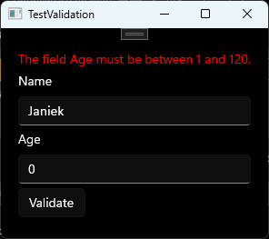
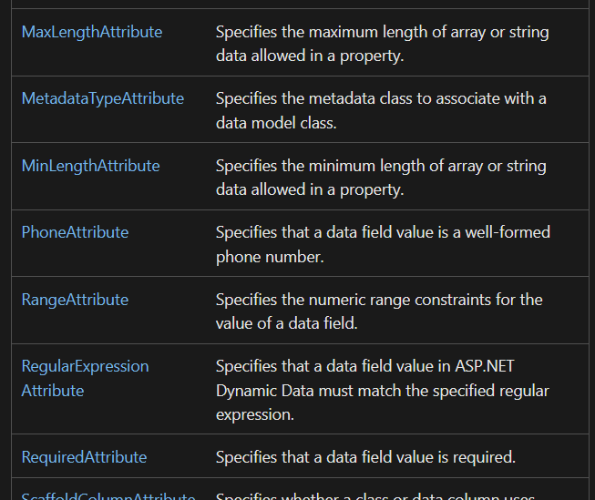

## API-data aanleveren vanuit EF Core

Met de 'Read' in 'CRUD' zijn we inmiddels goed bekend: we weten dat we in Entity Framework gegevens kunnen ophalen via een `DbSet` in een Database Context. In week 7 gaf je API nog een hardcoded lijst terug. Nu vervangen we die door echte databasegegevens.

In je route-afhandeling open je gewoon een context, net als in de console-app van week 4:

```csharp
if (pad == "/voertuigen")
{
    using var db = new DeSleutelContext();
    List<Voertuig> voertuigen = db.Voertuigen.ToList();

    string json = JsonSerializer.Serialize(voertuigen);
    // ... omzetten naar bytes en versturen
}
```

Voor één voertuig combineer je het uitlezen van het id uit de URL (week 7) met een query op de database:

```csharp
using var db = new DeSleutelContext();
Voertuig? voertuig = db.Voertuigen.FirstOrDefault(v => v.Id == id);

if (voertuig == null)
{
    context.Response.StatusCode = 404;
    // stuur een JSON-foutmelding
}
else
{
    string json = JsonSerializer.Serialize(voertuig);
    // stuur het voertuig
}
```

Een POST-verzoek (nieuw voertuig toevoegen) lees je uit via de `InputStream` van de request:

```csharp
if (context.Request.HttpMethod == "POST" && pad == "/voertuigen")
{
    using var reader = new StreamReader(context.Request.InputStream);
    string body = reader.ReadToEnd();

    var options = new JsonSerializerOptions { PropertyNameCaseInsensitive = true };
    Voertuig? nieuw = JsonSerializer.Deserialize<Voertuig>(body, options);

    using var db = new DeSleutelContext();
    db.Voertuigen.Add(nieuw);
    db.SaveChanges();
}
```

<x-callout type="tip">

Je API is nu de brug tussen de client en de database, precies zoals bij "moderne systemen" in week 6: de client praat met de API, de API praat met de database.

</x-callout>

## 5.2 Invoer valideren

Om een degelijke applicatie te maken, moeten we nog wel de invoer van de gebruiker controleren. Dat noemen we **validatie** (Engels: *validation*).

Er zijn meerdere manieren om invoer te valideren; in dit moduleboek bespreken we er twee:

1. **If-statements:** controleer met simpele if-statements of de invoer aan voorwaarden voldoet.
2. **Data Annotations:** met 'attributen' uit de ingebouwde package `System.ComponentModel.DataAnnotations` leggen we voorwaarden voor invoer vast.

Hier betekent het Engelse woord "Annotations": annotaties. Ook wel: aanmerking, aantekening of kanttekening. Met C#-attributes kunnen we extra informatie bij onder andere classes, methodes en eigenschappen plaatsen.

```csharp
public class User
{
    [Required]
    [MaxLength(50)]
    public string Name { get; set; }

    [Range(1, 120)]
    public int Age { get; set; }
}
```

We demonstreren de twee manieren aan de hand van een simpele applicatie met een naam-invoerveld (`nameTextBox`), een leeftijd-invoerveld (`ageTextBox`), een `Validate`-knop en een leeg tekstveld `validationResultsTextBlock` waarin in het rood een bericht bovenaan het formulier getoond wordt.



<x-callout type="note">

In dit voorbeeld is het een knop in een venster, maar dezelfde validatiecode werkt net zo goed in een console-app of in een API-endpoint — je maakt een object van de ingevoerde gegevens en controleert dat.

</x-callout>

### Valideren met if-statements

```csharp
private void validateButton_Click(object sender, RoutedEventArgs e)
{
    var user = new User
    {
        Name = nameTextBox.Text,
        Age = int.TryParse(ageTextBox.Text, out var age) ? age : 0
    };

    var errors = new List<string>();

    if (string.IsNullOrWhiteSpace(user.Name))
    {
        errors.Add("The Name field is required.");
    }
    else if (user.Name.Length > 50)
    {
        errors.Add("The field Name must be a string with a maximum length of 50.");
    }

    if (user.Age < 1 || user.Age > 120)
    {
        errors.Add("The field Age must be between 1 and 120.");
    }

    if (errors.Count > 0)
    {
        validationResultsTextBlock.Text = string.Join(Environment.NewLine, errors);
    }
    else
    {
        validationResultsTextBlock.Text = "Validation succeeded!";
    }
}
```

### Valideren met Data Annotations

Allereerst staat bovenin het script van de `User`-model en de Window:

```csharp
using System.ComponentModel.DataAnnotations;
```

De `User`-model krijgt deze attributen die de data 'annoteren':

```csharp
public class User
{
    [Required]
    [MaxLength(50)]
    public string Name { get; set; }

    [Range(1, 120)]
    public int Age { get; set; }
}
```

Bij het klikken op de knop **instantiëren** we een `User` met de ingevoerde gegevens. Vervolgens maken we een `ValidationContext` en roepen we `Validator.TryValidateObject` aan, die aan de hand van de attributen in de `User`-model validatie gaat uitvoeren:

```csharp
private void validateButton_Click(object sender, RoutedEventArgs e)
{
    var user = new User
    {
        Name = nameTextBox.Text,
        Age = int.TryParse(ageTextBox.Text, out var age) ? age : 0
    };

    var context = new ValidationContext(user);
    var results = new List<ValidationResult>();

    if (!Validator.TryValidateObject(user, context, results, true))
    {
        var errors = new List<string>();

        foreach (var validationResult in results)
        {
            errors.Add(validationResult.ErrorMessage);
        }

        validationResultsTextBlock.Text = string.Join(Environment.NewLine, errors);
    }
    else
    {
        validationResultsTextBlock.Text = "Validation succeeded!";
    }
}
```

In de documentatie van Microsoft is een lijst te vinden met alle attributen die je bij een eigenschap kunt plaatsen: <https://learn.microsoft.com/en-us/dotnet/api/system.componentmodel.dataannotations>



![Dezelfde documentatietabel met pijlen die MaxLengthAttribute, RangeAttribute en RequiredAttribute koppelen aan een codevoorbeeld met [Required], [MaxLength(50)] en [Range(1, 120)]](./assets/dataannotations-attributen.jpg)

<x-callout type="warning">

C#-attribute-classes zijn bijzonder: je mag bij het gebruiken van de klasse de 'Attribute'-suffix weglaten. Dus je mag zowel `[RequiredAttribute]` als `[Required]` schrijven, beide zijn valide.

</x-callout>

<x-compare>
<x-compare-item title="If-statements">

- Volledige controle, geen extra kennis nodig
- Wordt al snel lang en repetitief bij veel velden
- De regel en de melding staan in je methode, niet bij het model

</x-compare-item>
<x-compare-item title="Data Annotations">

- Kort: de regels staan als attributen bij het model
- Herbruikbaar: overal waar je het model valideert gelden dezelfde regels
- Je hebt `Validator.TryValidateObject` één keer nodig

</x-compare-item>
</x-compare>

## 5.3 Validatie met [RegularExpression]

De `[RegularExpression]`-attribuut in C# (meestal gebruikt in combinatie met data-annotaties) valideert of een string overeenkomt met een bepaald **patroon**. Dit patroon wordt geschreven in een **Regular Expression** (regex).

**Gebruik:**

```csharp
[RegularExpression(@"^[0-9]{4}[A-Z]{2}$", ErrorMessage = "Postcode moet 4 cijfers gevolgd door 2 hoofdletters zijn.")]
public string Postcode { get; set; }
```

In dit voorbeeld valideert het attribuut of de postcode voldoet aan het formaat `1234AB`.

### Wat is Regular Expression?

Een regex is een **tekstpatroon** waarmee je kunt controleren of een string aan bepaalde eisen voldoet. Regex is niet alleen onderdeel van C#, maar bestaat ook in veel andere talen zoals: JavaScript, Python, Java, PHP, Ruby, Perl en zelfs in text editors zoals VS Code en Notepad++.

### Voorbeelden met uitleg per teken

**Nederlandse postcode:** `^[0-9]{4}[A-Z]{2}$`

- `^` — begin van de string
- `[0-9]{4}` — precies 4 cijfers:
  - `[` — start set
  - `0-9` — de cijfers 0 t/m 9
  - `]` — eind set
  - `{` — start herhalingsinformatie, herhaalt wat hiervoor stond (de set) zo veel keer
  - `4` — precies 4 keer
  - `}` — eind herhalingsinformatie
- `[A-Z]{2}` — precies 2 hoofdletters
  - `A-Z` — de letters A t/m Z (in hoofdletters)
- `$` — einde van de string

Voorbeeld geldig: `1234AB` — Ongeldig: `123AB`, `1234ab`, `12 34AB`

Nu schrijven sommige mensen hun postcode wel eens met een spatie tussen de cijfers en letters. We zouden de regex als volgt kunnen aanpassen om ook een spatie toe te staan: `^[0-9]{4}\s?[A-Z]{2}$`

In deze aangepaste regex betekent `\s?` dat op die plek een spatie of ander witruimte-teken (`\s`) optioneel (`?`) is. Nu ook geldig: `1234 AB`

**Telefoonnummer (NL mobiel):** `^06\d{8}$`

- `^` — begin van de string
- `06` — moet beginnen met 06
- `\d{8}` — precies 8 cijfers, `\d` = cijfer
- `$` — einde van de string

Voorbeeld geldig: `0612345678` — Ongeldig: `0712345678`, `06-12345678`

Je kunt Regular Expression dus gebruiken om complexere validatieregels te schrijven. Via deze website kun je jouw regex testen en uitleg vinden over de overige tekens: <https://regex101.com/>

![Screenshot van regex101.com met de regex ^[0-9]{4}\s?[A-Z]{2}$, een lijst teststrings waarvan 4813 AB en 1212AB matchen (groen omcirkeld) en 222BA, test en 2112 aa niet (rood kruis). Links is de flavor '.NET 7.0 (C#)' geselecteerd.](./assets/regex101.png)

<x-invul>
prompt: Vul de regex aan die precies 4 cijfers, dan precies 2 hoofdletters vereist (postcode zonder spatie).
code: |-
  ^[0-9]___[A-Z]___$
blanks:
  - answer: "{4}"
  - answer: "{2}"
explanation: "{4} en {2} geven aan hoe vaak de set ervoor herhaald moet worden."
</x-invul>

<x-vind-de-fout>
code: |-
  public class Klant
  {
      [Required]
      public string Naam { get; set; }

      [Range(1, 120)]
      public string Leeftijd { get; set; }
  }
errorLine: 7
hint: Kijk naar het type van de property waar [Range] op staat.
explanation: "[Range(1, 120)] hoort op een getal (int), niet op een string. Maak van Leeftijd een int."
</x-vind-de-fout>

<x-nav label="Klaar met de theorie?">
[Oefeningen](/pages/week8-oefeningen.html)
[Quiz](/pages/week8-meetmoment.html)
[Inleveropdracht](/pages/week8-inleveropdracht.html)
[Checklist](/pages/checklist.html)
</x-nav>
