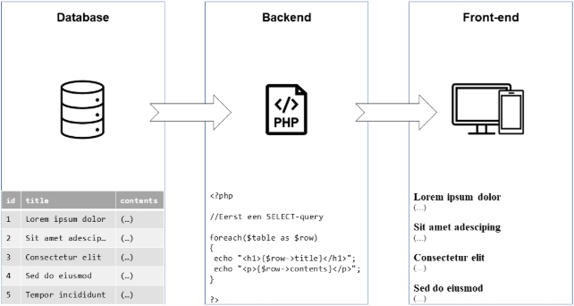
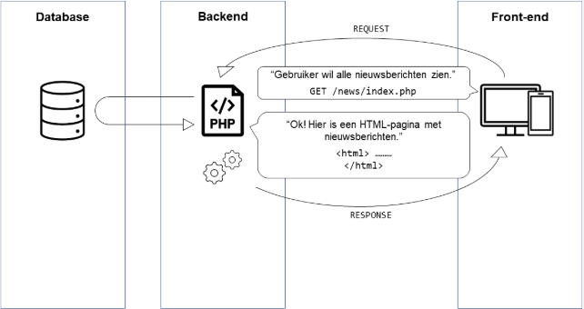
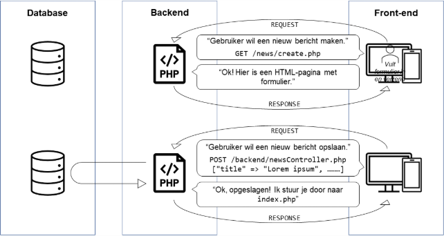

## 4.8 Een API bouwen

Om een API te kunnen aanbieden moeten we een webserver opzetten. Die gaat op verzoeken reageren met JSON-antwoorden.

In Blok B heb jij bij WDV-III en DBS-I geleerd over front-end, back-end en de request/response-cyclus. Laten we de theorie daaruit nog eens kort herhalen.

## 4.9 Front-end / back-end (lagen van een webapp)

Het bouwen van een webapp werkt iets anders dan een lokale Windows-applicatie met bijvoorbeeld Python of C#. In die laatste programmeertalen staat je héle programma op de computer van de gebruiker. Alle code (of de gecompileerde versie daarvan) werkt dus eigenlijk lokaal.

Bij een webapp is dat anders; het back-end-gedeelte (bijv. de PHP-code of het C#-serverprogramma) staat alleen op de server. De gebruiker krijgt alleen de front-end op zijn computer, de HTML en CSS dus, of in het geval van een API: de JSON.

<x-card title="Kernbegrip: lagen van een webapp (front-end / back-end / database)">

Een applicatie bestaat vaak uit drie "lagen". Bij een webapp zijn die lagen ook echt van elkaar gescheiden (dat is bij Windows-apps bijvoorbeeld niet zo):

- **Database:** tabellen met gegevens.
- **Backend:** het "brein" van de applicatie. De backend haalt informatie uit de database (bijvoorbeeld alle nieuwsberichten) en maakt daar HTML-pagina's of JSON-antwoorden van. De backend zorgt ook voor het opslaan van nieuwe gegevens. De back-end is de baas, de front-end doet alleen verzoeken (die door de back-end gecontroleerd worden).
- **Front-end:** wat de gebruiker ziet in de browser: HTML en CSS die voor een deel gegenereerd zijn door het serverprogramma. Of een JSON-antwoord in het geval van een API.

</x-card>



Je back-end-programma genereert dus eigenlijk een stuk van de HTML wanneer een gebruiker je webapp bezoekt. De server (backend) zet de hele pagina in elkaar en stuurt die naar de gebruiker toe, die op zijn eigen computer de front-end kan bekijken.

Daarnaast regelt de backend ook het invoegen, aanpassen en verwijderen van items. Dat gebeurt natuurlijk altijd op aanvraag van een gebruiker. Ook het bouwen van een HTML-pagina gebeurt pas wanneer een gebruiker je site bezoekt. Er gaat altijd een "request" aan vooraf.

## 4.10 Request / response (hoe het internet werkt)

Als je een website bezoekt doet je browser dus eigenlijk een request naar de server waar de website staat. Die server antwoordt door de webpagina op te sturen; we noemen dat een response. Het gebruiken van een website levert een hele reeks van die requests en responses op. Iedere link die je aanklikt en ieder formulier dat je verstuurt zorgen voor een nieuw verzoek naar de server.

<x-card title="Kernbegrip: request/response-cycle">

De **request/response-cycle** verklaart wat er op de achtergrond gebeurt als je een website bezoekt. De browser doet een verzoek (*request*) naar de server, waarop de server een antwoord stuurt (*response*).

Iedere actie op een website leidt tot een nieuwe *request* (denk aan: link aanklikken, formulier versturen).

- **Request:** een verzoek of opdracht aan de server. Er zijn twee soorten *requests*:
  - **GET:** het verzoek om een pagina te tonen. Bijvoorbeeld `GET /users/index.php` zal een overzicht van alle gebruikers opvragen.
  - **POST:** het versturen van een formulier, inclusief gegevens. Bijvoorbeeld `POST /backend/loginController.php ['user'=>'example', 'password' => '****']` zal de *request* zijn die je browser doet nadat je op "login" drukt onderaan een formulier.
- **Response:** na een verzoek gaat de server aan de slag. Bijvoorbeeld om alle gebruikers uit de database te halen en in een HTML-lijst te zetten, of om de gebruiker in te loggen. Daarna stuurt de server een antwoord terug. Die *response* kan een stuk HTML zijn, maar ook een *redirect* naar een andere pagina.

Na een *request* volgt áltijd een *response*, daarom noemen we het een cyclus. Dit is de basis van het **HTTP-protocol**. Je moet nog weten dat de server je niet onthoudt; wanneer je een tweede *request* doet heeft de server geen idee dat jij dezelfde persoon bent als van het eerste verzoek. We zeggen ook wel dat HTTP een "**stateless**" protocol is (technieken die wel onthouden wie je bent, noemen we state*ful*).

</x-card>

Deze kennisclip legt het principe nog eens uit met animaties erbij: <https://youtu.be/bFMkDEPDkDo>. Op onderstaande afbeelding zie je de cyclus duidelijk terug:

- De computer vraagt om een pagina te zien (*request*).
- De server doet wat slimme dingen (query naar de database, PHP-code uitvoeren).
- De server stuurt als antwoord een stuk HTML terug (*response*).



In onderstaande afbeelding zie je hoe er ook vaak twee cycli op elkaar volgen: eerst vraagt de computer om de pagina met een formulier, daarna vult de gebruiker het formulier in en verstuurt dat. Het versturen van het formulier is de tweede cyclus die je ziet.



## 4.11 Wat je nodig hebt om in C# een eigen webserver te schrijven

Allereerst moet je je ervan bewust zijn dat we onze webserver als Console App gaan bouwen. Dit doen we om onze applicatie zo efficiënt mogelijk te houden. We hoeven geen mooie interface voor de webserver zelf. De administrator die de webserver aanzet, zal simpelweg instellen dat de webserver-console-app bij het opstarten van de server opstart.

Dankzij de ingebouwde netwerkfunctionaliteiten in Windows is het redelijk toegankelijk om een eigen webserver te schrijven in C#. We kunnen de `System.Net.HttpListener` gebruiken: <https://learn.microsoft.com/en-us/dotnet/api/system.net.httplistener?view=net-7.0>

Die `HttpListener` gaat zoals de naam al beschrijft: luisteren naar HTTP-verzoeken. We stellen een adres en poort in waarop deze luistert en starten de listener:

```csharp
using var listener = new HttpListener();
listener.Prefixes.Add("http://localhost:8080/");
listener.Start();
```

Vanaf dan kunnen we opvragen of er een HTTP-verzoek is binnengekomen op de poort waar we naar luisteren:

```csharp
HttpListenerContext context = listener.GetContext();
HttpListenerRequest request = context.Request;
HttpListenerResponse response = context.Response;
```

De `.GetContext()`-methode is bijzonder hier, want de applicatie blijft in de `GetContext`-methode wachten totdat er een verzoek is binnengekomen. Als je een breakpoint zet na die regel merk je dat die pas wordt bereikt wanneer een verzoek binnenkomt. Dat werkt net zoals `Console.ReadLine()` die wacht totdat de gebruiker iets getypt heeft en op enter drukt.

Wanneer er een verzoek is binnengekomen kunnen we uit de `Request` en `Response` van de `HttpListenerContext` informatie halen over het verzoek en het antwoord opbouwen en versturen.

**Een verzoek beantwoorden:**

```csharp
// Zet de string om naar rauwe bytes
byte[] buffer = System.Text.Encoding.UTF8.GetBytes(responseString);

// We moeten in het antwoordpakket aangeven hoe lang ons antwoord is
response.ContentLength64 = buffer.Length;

// Schrijf je antwoord naar de 'OutputStream' in het antwoordpakket. Dit is een
// soort tunnel waardoor je het antwoord kunt schrijven naar de client.
Stream output = response.OutputStream;
output.Write(buffer, 0, buffer.Length);

// Klaar met schrijven? Sluit dan de tunnel.
output.Close();
```

In de `HttpListenerContext.Response` zit een "`OutputStream`". In C# kom je de term **Stream** (in het Nederlands 'stroom' zoals in waterstroom) tegen op deze plekken:

- Schrijven of lezen naar bestanden
- Schrijven of lezen van/naar computers over een netwerk (zoals het internet)

Je kunt een Stream zien als een tunnel naar een eindadres. Je moet eerst door de tunnel roepen hoe lang het bericht is (`response.ContentLength64`) en vervolgens het bericht byte-voor-byte erdoor schrijven. We kunnen tekst niet zomaar sturen, maar moeten het dus omzetten naar bytes.

Als de ontvanger aan de andere kant van de Stream-tunnel de gegevens gaat lezen, weet die dankzij de `ContentLength64` hoe lang het bericht is. Zodra alle bytes binnen zijn kan die dan het bericht weer opbouwen tot het originele type. Als het een string was bijvoorbeeld tot een string met:

```csharp
string textAgain = System.Text.Encoding.UTF8.GetString(buffer);
```

## 4.12 Routes in een webapplicatie

Routing in een webserver houdt in dat verschillende URL's worden gekoppeld aan bepaalde acties of antwoorden. Een webserver kan de URL-structuur van een verzoek gebruiken om te bepalen welke actie of pagina aan de gebruiker moet worden teruggestuurd. Bijvoorbeeld, bij het bezoeken van "/hello" kan de server een groet tonen, en bij "/goodbye" een afscheid.

Een belangrijk onderdeel van deze logica is het herkennen van de URL-paden, wat in C# kan worden gedaan met `HttpListenerRequest`:

```csharp
HttpListenerContext context = listener.GetContext();
HttpListenerRequest request = context.Request;
```

De URL-paden worden eenvoudig geëxtraheerd via `request.Url.AbsolutePath` of via `request.Url.Segments`, waarna je logica toepast om verschillende routes af te handelen.

**`request.Url.AbsolutePath`:**

Bij het navigeren naar `http://localhost:8080/test` is de `AbsolutePath`: `/test`

```csharp
// Basic routing
if (request.Url.AbsolutePath == "/hello")
{
}
```

**`request.Url.Segments`:**

`request.Url.Segments` bevat bij een verzoek naar `http://localhost:8080/user/1`:

- `[0]` = `/`
- `[1]` = `/user/`
- `[2]` = `1`

<x-invul>
prompt: Vul de code aan die een webserver start die luistert op poort 8080.
code: |-
  using var listener = new HttpListener();
  listener.Prefixes.___("http://localhost:8080/");
  listener.___();
blanks:
  - answer: Add
  - answer: Start
explanation: "Je voegt een prefix (adres + poort) toe en roept daarna Start() aan."
</x-invul>

<x-keuzevraag>
question: Wat doet listener.GetContext()?
options:
  - Het stuurt meteen een antwoord terug
  - Het wacht (blokkeert) tot er een HTTP-verzoek binnenkomt
  - Het sluit de server af
  - Het leest een bestand van schijf
correct: 1
explanation: Net als Console.ReadLine() blijft de code op deze regel wachten tot er iets binnenkomt.
</x-keuzevraag>

<x-nav label="Klaar met de theorie?">
[Oefeningen](/pages/week7-oefeningen.html)
[Quiz](/pages/week7-meetmoment.html)
[Week 8](/pages/week8-theorie.html)
</x-nav>
